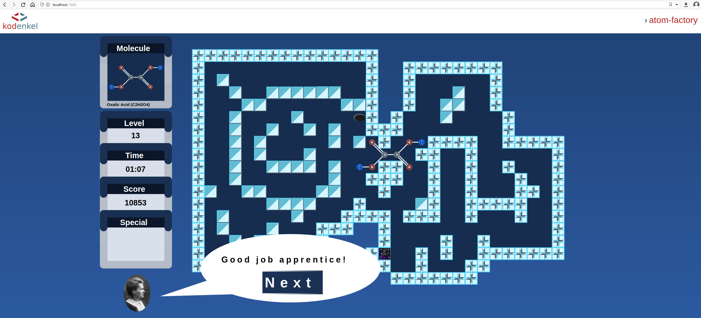

# kodenkel-atom-factory

Classic puzzle game re-imagined. Assemble molecules on a board. Browser game with vector graphics, sound, includes 14 levels.

You can try it out at: https://www.kodenkel.com/games/atom-factory/



The game was designed to be played on monitors with at least HD resolution. Levels are comprised of 40x30 tiles, which makes the levels more challengeing, and varied. That said, the game works on mobile phones, but the control may be tricky there. 

Have fun!

If you like this project, or found it useful:

[](https://www.buymeacoffee.com/kodenkel)

## Pre-requisites

- NodeJS
- npm

## Building

```
npm install
yarn build-all
yarn esbuild-browser:dev
```

Later on, just simply run the ./build.sh included.

## Assets

The assets are not covered by the license, only the source code.

Unzip the assets/assets.zip file before running.

## Running it Locally

Serve up the contents of the work directory with your favorite web server.

PHP comes with a simple server. To use it, run the following in the work directory:

```
php -S localhost:7000
```

Then visit localhost:7000 in a modern browser.

## Notice

kodenkel atom-factory, Copyright (C) 2022 Gabor Major
atom-factory comes with ABSOLUTELY NO WARRANTY
This is free software, and you are welcome to redistribute it under certain conditions

